# Project 4: Design Journey

Your Team Name: Purple Tiger

**All images must be visible in Markdown Preview. No credit will be provided for images in your repository that are not properly linked in Markdown. Assume all file paths are case sensitive!**


## Client Description

[Tell us about your client. Who is your client? What kind of website do they want? What are their key goals?]

[NOTE: If you are redesigning an existing website, give us the current URL and some screenshots of the current site. Tell us how you plan to update the site in a significant way that meets the final project requirements.]

Our client is Cornell Thrift. They want a website for cornell students who are interested in the club activities: the events they are hosting and the organization mission. Their key goals are to have a new website that uses the content of their existing website with newly added features, such as forms for updating current event, forms for sign up
for mailing list, image gallery.


## Meeting Notes

[By this point, you have met once with your client to discuss all their requirements. Include your notes from the meeting, an email they sent you, or whatever you used to keep track of what was discussed at the meeting. Include these artifacts here.]

Meeting 1 Notes - Client Requirements:
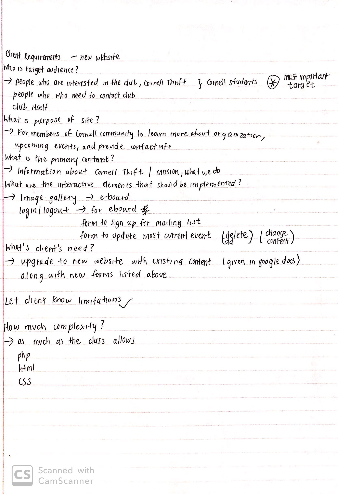

## Purpose & Content

[Tell us the purpose of the website and what it is all about.]
The purpose of the website is to promote Cornell Thrift and have Cornell students know the upcoming events that Cornell Thrift is hosting.


## Target Audience(s)

[Tell us about the potential audience for this website. How, when, and where would they interact with the website? Get as much detail as possible from the client to help you find representative users.]

The potential audience for this website are members of the club and people at Cornell who are intersted in what Cornell Thrift do. The target audiences will be able to find mission of the club and more information (image and position) about eboard members. Also, they can look for the upcoming events/activities such as 'Thrift Exchange Closets' or 'Pop-up Shop'. For anyone who would like to be part of the club can subscribe for newsletter, they can fill out the form. Only Eboard members will be able to upload/delete events and gallery.

We decided that the client (i.e. E-Board members) should be considered a second target audience because there is a lot of funcionality that the client requested for its e-board members. There are a lot of aspects of the website that need to be regularly updated and E-board needs access to that. This aspect of the website is significant enough that we believed that it warranted making the client a second target audience.


## Client Requirements & Target Audiences' Needs

[Collect your client's needs and wants for the website. Come up with several appropriate design ideas on how those needs may be met. In the **Rationale** field, justify your ideas and add any additional comments you have. There is no specific number of needs required for this, but you need enough to do the job.]

- Client Requirement #1
  - **Requirement or Need** [What does your client and audience need or want?]
    - The client wants to retain site visitors and keep them informed via newslettlers
  - **Design Ideas and Choices** [How will you meet those needs or wants?]
    - Include a mailing list form in the footer to encourage users to sign up for the newsletter listserv
    - Show confirmation message once signed up
  - **Rationale** [Justify your decisions; additional notes.]
    - Having the mailing list form on every page would remind the visitor of the listserv opportunity.

- Client Requirement #2
  - **Requirement or Need** [What does your client and audience need or want?]
    - The thrift club wants people to be able to reach out to them for more information.
  - **Design Ideas and Choices** [How will you meet those needs or wants?]
    - Include a contact form on a contact page.
  - **Rationale** [Justify your decisions; additional notes.]
    - The contact form would allow users to send messages to the client and provide an email and name for correspondence.

- Target Audience Needs #1
  - **Requirement or Need** [What does your client and audience need or want?]
    - The Cornell students interested in thrift need to be aware of the upcoming events hosted by the client.
  - **Design Ideas and Choices** [How will you meet those needs or wants?]
    - Include the upcoming events near the top of the events page
  - **Rationale** [Justify your decisions; additional notes.]
    - This makes it easy for the visitors to find what events they should be looking out for.

- Target Audience Needs #2
  - **Requirement or Need** [What does your client and audience need or want?]
    - The E-Board members of the club need to be able to login and update site content.
    - Give logged in members access to forms that update the site.
  - **Design Ideas and Choices** [How will you meet those needs or wants?]
    - Include a login button in the header of the site so that members are able login appropriately.
    - Show a logout button when the members are logged in.
  - **Rationale** [Justify your decisions; additional notes.]
    - This creates intuitive user access control.


## Initial Design

[Include exploratory idea sketches of your website.]

### **Home Page**
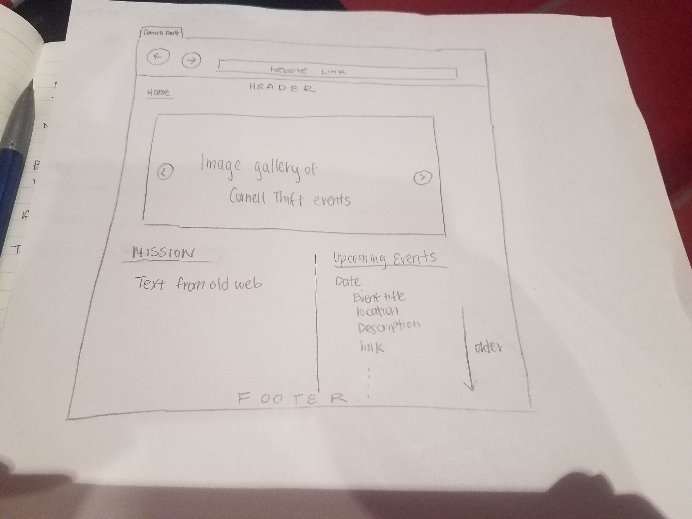

### **About Page**
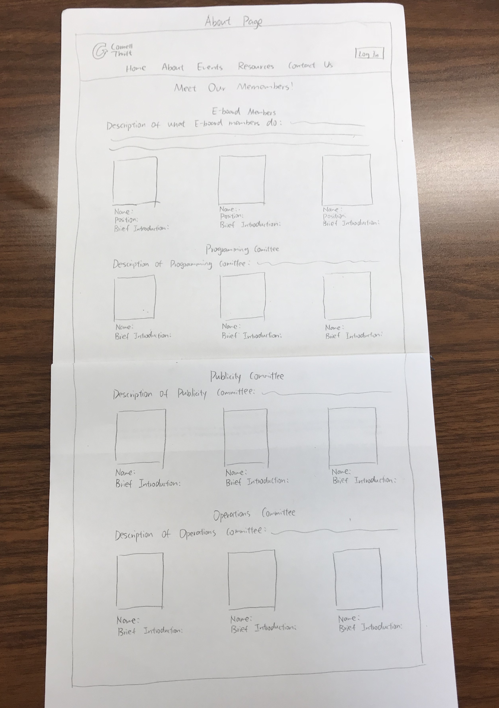

### **Events Page**
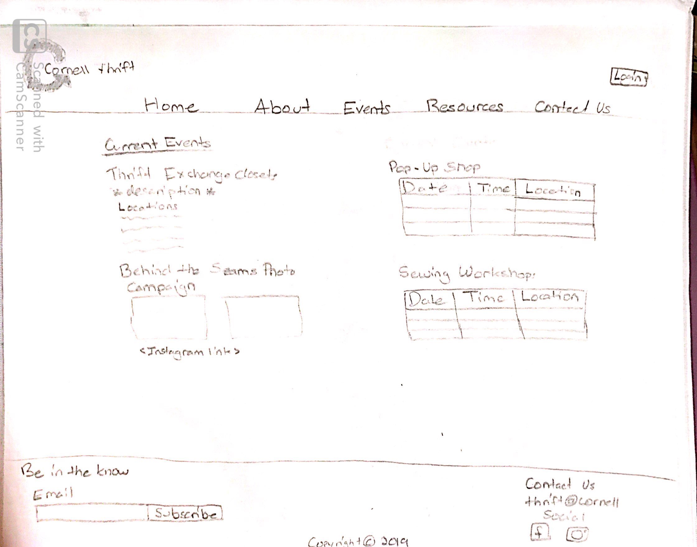

### **Resources Page**
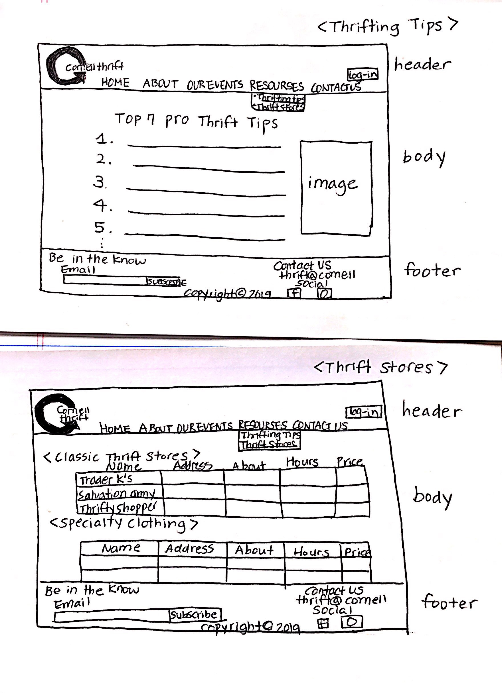

### **Login Page**
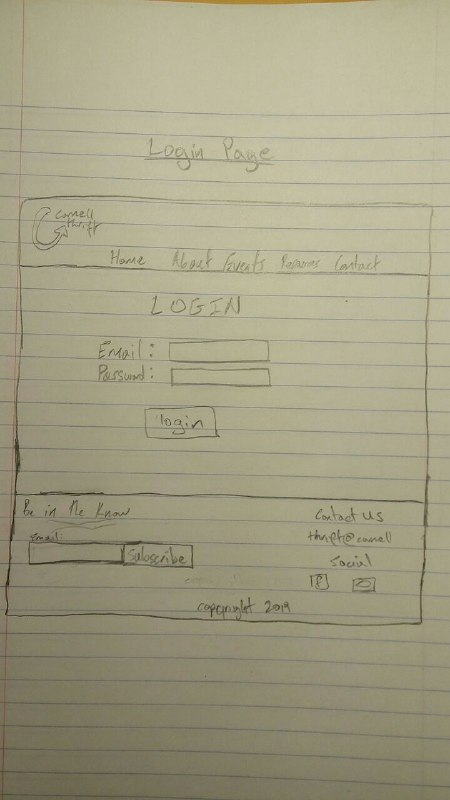

### **Contact Page**
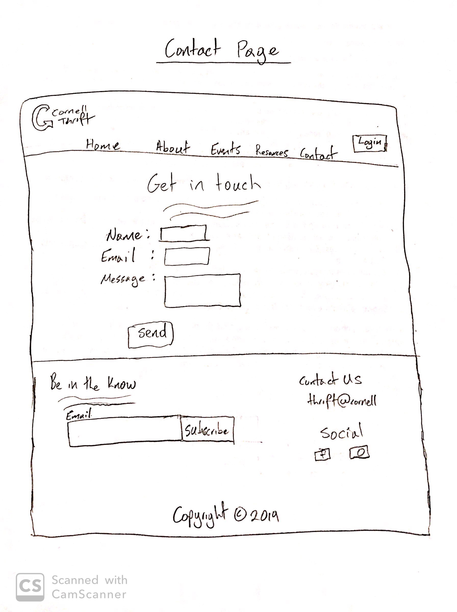


## Information Architecture, Content, and Navigation

[Lay out the plan for how you'll organize the site and which content will go where. Note any content (e.g., text, image) that you need to make/get from the client.]

[Document your process, we want to see how you came up with your content organization and website navigation.]

[Note: There is no specific amount to write here. You simply need enough content to do the job.]

Example:
- **Navigation**
  - Home
  - Portfolio
    - Websites
    - Mobile Apps
    - Tablets
  - About Me


Our:
  - Home
  - About(Members & Committees)
  - Our Events
  - Thrifting Resources
  - Contact Us


- **Content** (List all the content corresponding to main navigation and sub-categories.)
  - *Portfolio*: list all the projects (as images) this client has worked on. When the image is hovered over, display a description of the project; add a search function to enable users search for specific projects;
  - *Websites*: showcase all the websites designed by the client, with thumbnail images and a brief description for each design;
  - *Mobile Apps*: showcase all the mobile apps designed by the client, with thumbnail images and a brief description for each design;
  - *Tablets*: showcase all the tablet applications designed by the client, with thumbnail images and a brief description for each design;

  *Our*:
    - *Home* : mission statement, slideshow about pictures about cornell thrift
    - *about* : committess that includes the team members and description of the committees
    - *our events* : include the Thrift exchange closets and locations
                    the behind the seams photo campaign and embedded link to instagram
                    pop up shops
                    sewing workshops
    - *thrifting resources* : resources hosted on old websited
    - *contact us* : form to contact Cornell Thrift with any questions and concerns
    - *login* : login/logout

- **Process**
  - [photo of card sort]
  - [explanation of how your come up with your content organization and navigation.]

 Explanation of content organization and navigation :
  - Client's target audience is Cornell Students who want to know about the club
  and know about the upcoming events.
  - Also, part of the client's needs on google doc they shared with us.

Most of the sorting of content came from how our client asked us to sort content and certain pages that they wanted on their website. However, we had a lot more leeway in terms of deciding how to implement a login form and various ways to contact the club. We started by putting the mailing list subscription and the get in touch with us form on the contact page, with the login form implemented in the nav bar.

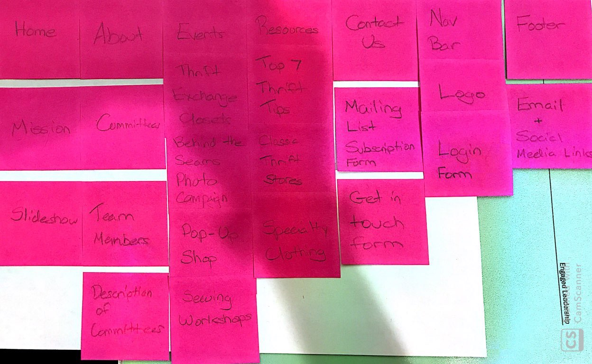

Then we decided to move the mailing list subscription into the footer so that users could access the form no matter what page their on, thus fulfilling the client's goal of reaching as many students as possible through both their website and mailing list.

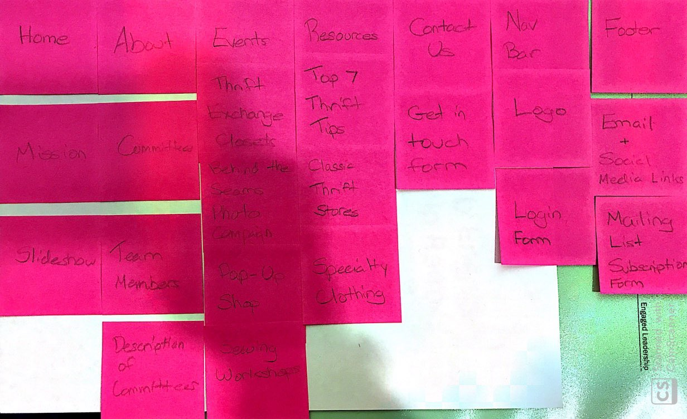

Finally, we decided to create a separate page for the login form in order to make the nav bar simpler for users.

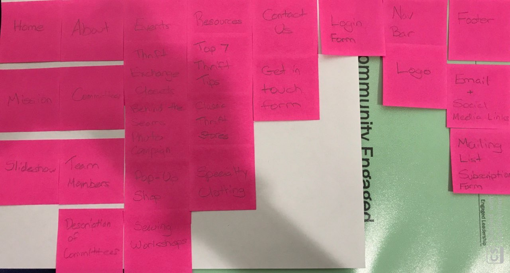

## Interactivity

[What interactive features will your site have? What PHP elements will you include?]
* We have a login/logout page for the E-board members of Cornell Thrift. The login/logout link will appear on the top right of each page.
* If a E-board member of Cornell Thrift is logged in, then he or she can upload new pictures and update events(make changes to the website)
* We have a contact form where people can put in their name and email address and write a message to the Cornell Thrift club.
* Under each page, we will have a form that says "Sign up for the mailling list" and takes in people's email

[Also, describe how the interactivity connects with the needs of the clients/target audience.]
* The login and logout functionality will make sure that Cornell Thrift's E-board members can edit their website and upload new contents which is what our client wants.
* The contact form allows people who are interested in Cornell Thrift to interact with the Eboard members which is what our client wants.
* The mailling list sign up would allow people who are interest in Cornell Thrift to get more information about this club which is what our client wants to happen.

## Work Distribution

[Describe how each of your responsibilities will be distributed among your group members.]

[Set internal deadlines. Determine your internal dependencies. Whose task needs to be completed first in order for another person's task to be relevant? Be specific in your task descriptions so that everyone knows what needs to be done and can track the progress effectively. Consider how much time will be needed to review and integrate each other's work. Most of all, make sure that tasks are balanced across the team.]

Milestone 1

Initial Sketches
- Home - Susan
- About - Yuyi
- Our Events - Samantha
- Thrifting Resources - Ha Yeon
- Contact Us, Header/Footer, Login - Clive

Clive has to sketch up the header and footer before the rest of the team and start their designs.

Milestone 2

- Samantha - Organize a team meeting in advance of the Milestone 2 deadline and the next client meeting

- Clive - Organize a second client meeting in advance of the Milestone 2 deadline

- Everyone is responsible for updating their own pseudocode, structure, and initial coding for each page/template as assigned above.

- The whole team will work together at the two team meetings to plan the database, update the design, and finish any other elements of the milestone not specified above.

Milestone 3

- Samantha - Organize a team meeting to work on the init.sql file to implement the database

- Everyone is responsible for implementing PHP elements and database interactivity for their individual page/templates as assigned above.

- Ha Yeon - Do final check of design to make sure there are no conflicts across pages.

Final Submission

- Everyone makes changes to their page as needed.

At Every Submissions

- Susan - Ensure we are on track to meet project guidelines and client expectations the night before the deadline

- Yuyi - Ensure that we are meeting each milestone requirement the night before the deadline


## Additional Comments

[If you feel like you haven't fully explained your design choices, or if you want to explain some other functions in your site (such as special design decisions that might not meet the final project requirements), you can use this space to justify your design choices or ask other questions about the project and process.]


--- <!-- ^^^ Milestone 1; vvv Milestone 2 -->

## Client Feedback

[Share the feedback notes you received from your client about your initial design.]

The client said that they liked our initial design and had no major changes to add except to make sure that we use their new logo design that they shared with us in our header.

## Iterated Design

[Improve your design based on the feedback you received from your client.]

Here is the updated logo the client requested that we use. We will alter the header design to reflect that.

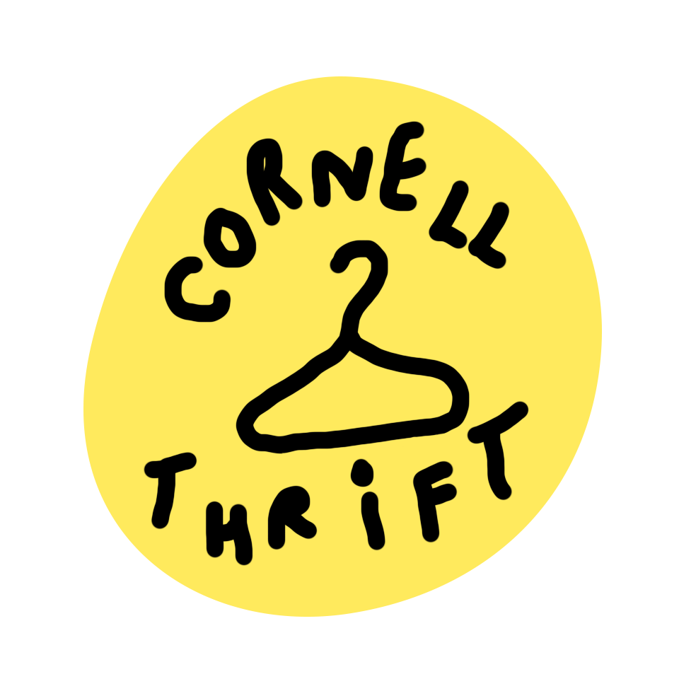


## Evaluate your Design

[Use the GenderMag method to evaluate your wireframes.]

[Pick a persona that you believe will help you address the gender bias within your design.]

I've selected **[Abby/Patricia/Patrick/Tim]** as my persona.
Our group selected **[Abby]** as our persona.

I've selected my persona because... [Tell us why you picked your persona in 1-3 sentences. Your explanation should include why your persona will help you address gender-inclusiveness bugs in your design.]

We selected Abby because we feel like Abby isn't comfortable with technology and
we want to include all users - those who are comfortable and those who are not.
We want the website to be as user-friendly as possible, so even non-technical people
like Abby can navigate the site and accomplish their tasks.

### Tasks

[You will need to evaluate at least 2 tasks (known as scenarios in the GenderMag literature). List your tasks here. These tasks are the same as the task you learned in INFO/CS 1300.]

[For each task, list the ideal set of actions that you would like your users to take when working towards the task.]

Task 1: Users wants to contact the club to ask a question.

  1. Go to Contact page   -Susan
  2. Fill out information under "Get in Touch"  -Clive
  3. Submit response   -Sam

Task 2: Client can modify members' information on About page.

  1. Go to About page  -Susan
  2. Log in   -Grace
  3. Modify Members' information  -Yuyi
  4. Submit the form  -Sam

### Cognitive Walkthrough

[Perform a cognitive walkthrough using the GenderMag method for all of your Tasks. Use the GenderMag template in the <documents/gendermag-template.md> file.]

#### Task 1 - Cognitive Walkthrough

[copy the GenderMag template here and conduct a cognitive walkthrough to evaluate your design (wireframes).]

[You may need to add additional subgoals and/or actions for each task.]

**Task 1: Users wants to contact the club to ask a question.**

[Add as many subgoals as you needs]
**Subgoal # 1 : Go to Contact page**
	(e.g., "# 1 : Select the section of the document you want to print")

  - Will [persona name] have formed this sub-goal as a step to their overall goal?
    - Yes, maybe or no: [yes/maybe/no]
    - Why? (Especially consider [persona name]'s Motivations/Strategies.)

        [Tell us why..]

[Add as many actions as you need...]
**Action # 1 : Click on Contact in navigation bar**
	(e.g., "# 1 : Put the mouse at the beginning of the section you want to print")

  - Will [persona name] know what to do at this step?
    - Yes, maybe or no: [yes/maybe/no]
    - Why? (Especially consider [persona name]'s Knowledge/Skills, Motivations/Strategies, Self-Efficacy and Tinkering.)

        [Tell us why...]

  - If [persona name] does the right thing, will she know that she did the right thing, and is making progress towards her goal?
    - Yes, maybe or no: [yes/maybe/no]
    - Why? (Especially consider [persona name]'s Self-Efficacy and Attitude toward Risk.)

        [Tell us why...]

**Subgoal # 2 : Fill out information under "Get in Touch"**

  - Will Abby have formed this sub-goal as a step to their overall goal?
    - Yes, maybe or no: Yes
    - Why? (Especially consider Abby's Motivations/Strategies.)

        * Each input field (Name, Email, and Message) on the contact page is labelled. Given that Abby has general exposure to technology this form would likely be familiar to her. Since Abby prefers to use familiar technology, she would comfortably form this sub-goal.

  **Action # 1 : Select the input field labelled "Name"**

    - Will Abby know what to do at this step?
      - Yes, maybe or no: Yes
      - Why? (Especially consider [persona name]'s Knowledge/Skills, Motivations/Strategies, Self-Efficacy and Tinkering.)

          Abby is an accountant, and since her job deals with keeping track of information she is probably familiar with input fields. This feature fits with Abby's low computer self-efficacy style since she does not have to go through unfamiliar processes.

    - If Abby does the right thing, will she know that she did the right thing, and is making progress towards her goal?
      - Yes, maybe or no: yes
      - Why? (Especially consider [persona name]'s Self-Efficacy and Attitude toward Risk.)

          The cursor would show up inside the input field. Given her comprehensive information processing style, she will easily access what happened.

  **Action # 2 : Type persona's "Name"**

  - Will Abby know what to do at this step?
    - Yes, maybe or no: Yes
    - Why? (Especially consider [persona name]'s Knowledge/Skills, Motivations/Strategies, Self-Efficacy and Tinkering.)

        The input field is labelled name. Abby gathers information comprehensively and she would realize that the name field is asking for her name for correspondence.

  - If Abby does the right thing, will she know that she did the right thing, and is making progress towards her goal?
    - Yes, maybe or no: Yes
    - Why? (Especially consider [persona name]'s Self-Efficacy and Attitude toward Risk.)

        The name will show up in the field as she types. Given her comprehensive information processing style, she will easily access what happened.

  **Action #3 : Repeat Action #1 and #2 for input fields "Email" and "Message"**

**Subgoal # 3 : Submit response**
	(e.g., "# 1 : Select the section of the document you want to print")

  - Will Abby have formed this sub-goal as a step to their overall goal?
    - Yes, maybe or no: [Yes]
    - Why? (Especially consider [persona name]'s Motivations/Strategies.)
        [Tell us why..]
      Abby will understand that once she has filled out the form she has to submit it. Although Abby does not like experimenting with new technology unnecessarily, submitting a form is a common feature across many websites that she will likely be familiar with.

[Add as many actions as you need...]
**Action # 1 : Click submit button**
	(e.g., "# 1 : Put the mouse at the beginning of the section you want to print")

  - Will Abby know what to do at this step?
    - Yes, maybe or no: [Yes]
    - Why? (Especially consider [persona name]'s Knowledge/Skills, Motivations/Strategies, Self-Efficacy and Tinkering.)

        [Tell us why...]
      Submit buttons are a really common feature across a lot of different platforms, so despite Abby's limited comfort with computers, she will likely understand that she needs to click the button to submit her responses.

  - If Abby does the right thing, will she know that she did the right thing, and is making progress towards her goal?
    - Yes, maybe or no: [maybe]
    - Why? (Especially consider [persona name]'s Self-Efficacy and Attitude toward Risk.)

        [Tell us why...]
      Right now, the website design doesn't indicate any kind of confirmation page after the form is successfully submitted. If no confirmation page pops up after she clicks submit, since Abby has low self-efficacy she will likely believe she did something wrong. However, if a confirmation page is included, Abby would likely understand that she did the right thing because the page would say she successfully submitted her response.

#### Task 2 - Cognitive Walkthrough

**Task 2: Client can modify members' information on About page.**

[Add as many subgoals as you needs]
**Subgoal # 1 : Go to About page**
	(e.g., "# 1 : Select the section of the document you want to print")

  - Will [persona name] have formed this sub-goal as a step to their overall goal?
    - Yes, maybe or no: [yes/maybe/no]
    - Why? (Especially consider [persona name]'s Motivations/Strategies.)

        [Tell us why..]

[Add as many actions as you need...]
**Action # [action number] : [action name]**
	(e.g., "# 1 : Put the mouse at the beginning of the section you want to print")

  - Will [persona name] know what to do at this step?
    - Yes, maybe or no: [yes/maybe/no]
    - Why? (Especially consider [persona name]'s Knowledge/Skills, Motivations/Strategies, Self-Efficacy and Tinkering.)

        [Tell us why...]

  - If [persona name] does the right thing, will she know that she did the right thing, and is making progress towards her goal?
    - Yes, maybe or no: [yes/maybe/no]
    - Why? (Especially consider [persona name]'s Self-Efficacy and Attitude toward Risk.)

        [Tell us why...]

**Subgoal # 2 : Log in**

  - Will Abby have formed this sub-goal as a step to their overall goal?
    - Yes, maybe or no: [yes]
    - Why? Abby is aware that in order to upload an image, she has to log in. Since logging in is a familiar task for Abby who uses technologies to accomplish her tasks, she will have formed this sub-goal as a step to their overall goal.

**Action # 1 : Select the input field labelled "Username"**

  - Will Abby know what to do at this step?
    - Yes, maybe or no: [yes]
    - Why? Abby will know that she has to select the input field labelled "username". She feels comfortable using technologies that she uses on regular basis. It is clear that she needs to select the input field before typign down her username.

  - If Abby does the right thing, will she know that she did the right thing, and is making progress towards her goal?
    - Yes, maybe or no: [yes]
    - Why? Abby will know that she did the right thing because by selecting the input field she will be able to type down her username and eventually sign in. There is nothing unfamiliar about this action for Abby.


**Action # 2 : Type persona's "Username"**

  - Will Abby know what to do at this step?
    - Yes, maybe or no: [yes]
    - Why? Abby will know that she has to type her username into the input field. She feels confident in using technologies that she feels comfortable with.

  - If Abby does the right thing, will she know that she did the right thing, and is making progress towards her goal?
    - Yes, maybe or no: [yes]
    - Why? If Abby does the right thing, she will know that she is making progress towards her goal because username would be filled in the input field. There is nothing unfamiliar about this action, and she does not need to spend extra time using unfamilar techonologies.


**Action # 3 : Repeat Action #1 and #2 for the input field labelled "Password"**

  - Will Abby know what to do at this step?
    - Yes, maybe or no: [yes]
    - Why? Same as above

**Action # 4 : Click log-in button**

  - Will Abby know what to do at this step?
    - Yes, maybe or no: [yes]
    - Why? Abby will know what to do after she fills in username and password in each input field. Loggin in is a familiar job for Abby who works as an accountant. She does not need to tinker with software systems that are new to her.

  - If Abby does the right thing, will she know that she did the right thing, and is making progress towards her goal?
    - Yes, maybe or no: [yes]
    - Why? Abby will know that she made a progress towards her goal, because when she clicks the log-in button, she will be logged in and eventually be able to fill out form to upload an image. Although she feels not confident when using technologies that are not used to her, logging in is not a high-level skill. It won't take much time for her.


**Subgoal # 3 : Modify Members' information**
	(e.g., "# 1 : Select the section of the document you want to print")

  - Will [persona name] have formed this sub-goal as a step to their overall goal?
    - Yes, maybe or no: [yes]
    - Why? (Especially consider [persona name]'s Motivations/Strategies.)

        [Tell us why..]

[Add as many actions as you need...]
**Action # 1 : Click on the "Click HERE to add New Members" link on the top page or click on the Delete or Modify link beneth each picture**
	(e.g., "# 1 : Put the mouse at the beginning of the section you want to print")

  - Will [persona name] know what to do at this step?
    - Yes, maybe or no: [yes]
    - Why? (Especially consider [persona name]'s Knowledge/Skills, Motivations/Strategies, Self-Efficacy and Tinkering.)

    Abby doesn't like tinkering, but because there's a link at the top that tells her explicily where she needs to click if she wants to add a new member's information, she's less likely to get confused and more likely to complete this action successfully. The same reason goes with the "Delete" and "Modify" link below each picture. Abby doesn't need to tinker around at all to be able to find out the use of these links because they are so explicit.

  - If [persona name] does the right thing, will she know that she did the right thing, and is making progress towards her goal?
    - Yes, maybe or no: [yes]
    - Why? (Especially consider [persona name]'s Self-Efficacy and Attitude toward Risk.)

      Because after Abby clicks on one of the links, she will be brought to the form section of the page. Although Abby has low self-efficacy, she's pretty familiar with forms, so she will know that she did the right thing.

**Action # 2 : Fill out the form**
	(e.g., "# 1 : Put the mouse at the beginning of the section you want to print")

  - Will [persona name] know what to do at this step?
    - Yes, maybe or no: [yes]
    - Why? (Especially consider [persona name]'s Knowledge/Skills, Motivations/Strategies, Self-Efficacy and Tinkering.)

    Abby is an accountant, so she should be pretty familiar with forms. And since Abby feels comfortable working with technologies that she is alredy familiar with, she should be able to complete this action successfully.

  - If [persona name] does the right thing, will she know that she did the right thing, and is making progress towards her goal?
    - Yes, maybe or no: [yes]
    - Why? (Especially consider [persona name]'s Self-Efficacy and Attitude toward Risk.)

      Abby is pretty familiar with the forms.

**Subgoal # 4 : Submit the form**
	(e.g., "# 1 : Select the section of the document you want to print")

  - Will Abby have formed this sub-goal as a step to their overall goal?
    - Yes, maybe or no: [Yes]
    - Why? (Especially consider [persona name]'s Motivations/Strategies.)

        [Tell us why..]
     A common feature of forms across many websites is the need to submit them upon completion. Since there is a submit button present Abby will likely understand that to be an instruction and know she has to submit the form, despite her lack of comfort with computing tasks.

[Add as many actions as you need...]
**Action # 1 : Click the submit button**
	(e.g., "# 1 : Put the mouse at the beginning of the section you want to print")

  - Will Abby know what to do at this step?
    - Yes, maybe or no: [yes]
    - Why? (Especially consider [persona name]'s Knowledge/Skills, Motivations/Strategies, Self-Efficacy and Tinkering.)

        [Tell us why...]
      While Abby is not very comfortable with computers, she will likely understand that she needs to click the button to submit her responses as submit buttons are a common feature on many websites and Abby should understand submit to be an instruction and upon comprehensively reviewing the form she will likely figure out she needs to click the button.


  - If Abby does the right thing, will she know that she did the right thing, and is making progress towards her goal?
    - Yes, maybe or no: [maybe]
    - Why? (Especially consider [persona name]'s Self-Efficacy and Attitude toward Risk.)

        [Tell us why...]
    Abby will only know if she did the right thing if there is a confirmation page. Right now, it is unclear if there will be a confirmation form once it is submitted. If there is no confirmation page, Abby will likely believe she did something wrong because she has low computer self-efficacy. If there is a confirmation page, Abby would likely know that she did the right thing because the page confirm it for her.

### Cognitive Walk-though Results

[Did you discover any issues with your design? What were they? How will you change your design to address the gender-inclusiveness bugs you discovered?]

[Your responses here should be **very** thorough and thoughtful.]

Our current design does not make clear whether there will be a confirmation once the form is sucessfully submitted, or any corrective feedback should the user not fill in aspects of a form correctly. It is important that corrective feedback and a confirmation message are factored into the design as users with low self-efficacy may struggle with both understanding their mistakes and knowing if they submitted forms correctly because of a lack of feedback. Our final design should include a confirmation message for every form and corrective feedback when users submit invalid responses.

## Final Design

[Include sketches of your finalized design.]

[What changes did you make to your final design based on the results on your cognitive walkthrough?]

About

We made sure that we have clear instructions throughout the webpage so people who don't like tinkering can complete their tasks without getting confused.

This is what unlogged in users will see:
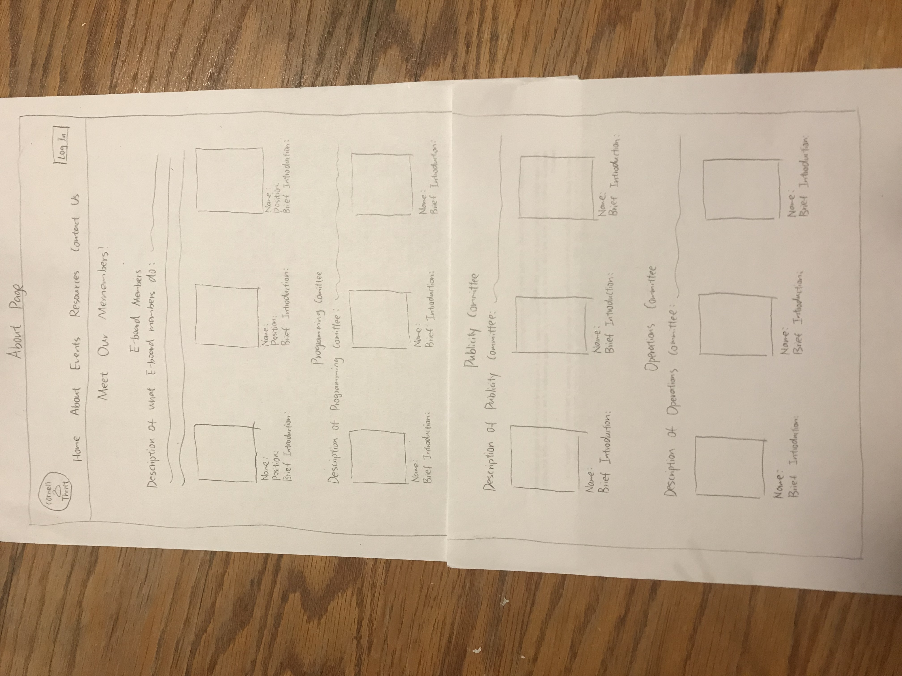

This is what logged in users will see:
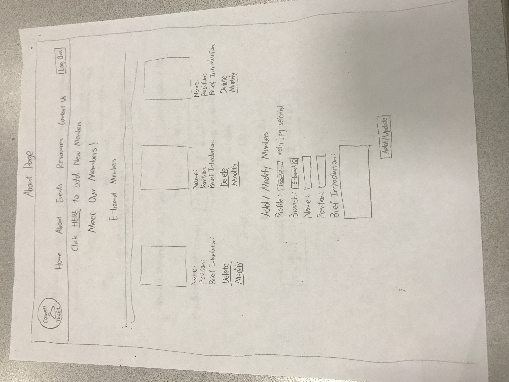
If the user clicks the "Modify" buttom, php will automatically fill out the "Add/Modify" form with the original information. The user just need to edit the category that he or she wants to modify, and click the "Add/Modify" buttom to update the information

Events

We made sure to clearly add a confirmation page so that  users who are less comfortable with computers understand that they have successfully submitted the form.

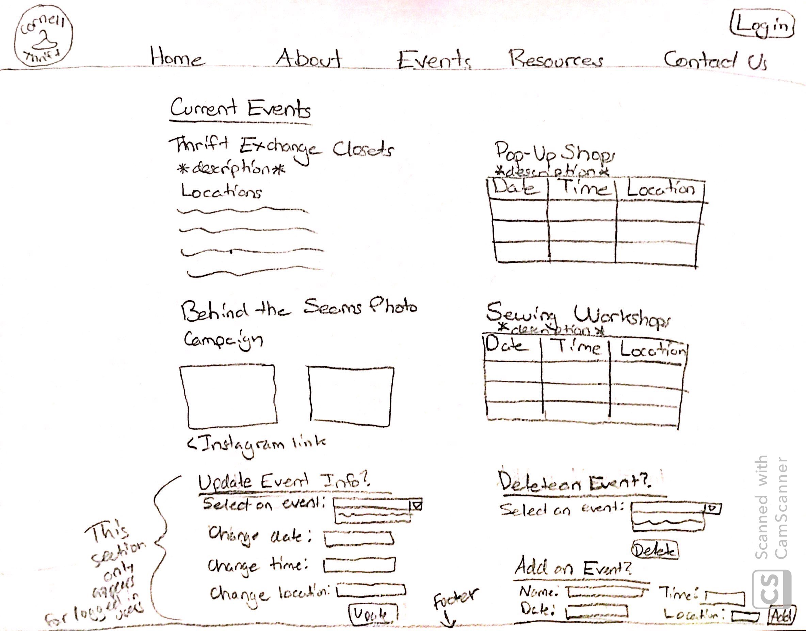

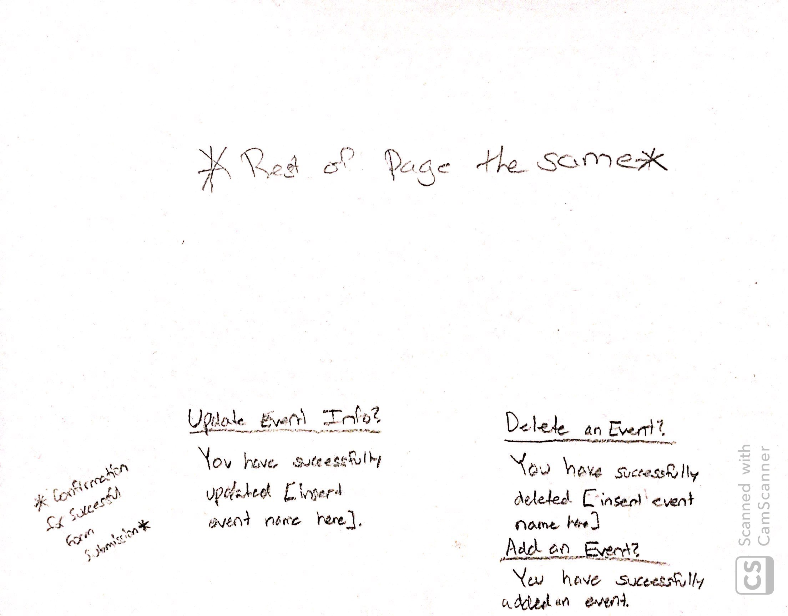

## Database Schema

[Describe the structure of your database. You may use words or a picture. A bulleted list is probably the simplest way to do this.]

Table: users
* id: INTEGER {PK, U, Not, AI} -- surrogate primary key
* username: TEXT {U}
* password: TEXT {}
* eboard: TEXT {Not}

Table: sessions
* id: INTEGER {PK, U, Not, AI} -- surrogate primary key
* user_id: INTEGER {Not}
* session TEXT {Not, U}

Table: home_images
* id: INTEGER {PK, U, Not, AI} -- surrogate primary key
* filename: TEXT {Not}
* file_extension: TEXT {Not}

Table: about_images
* id: INTEGER {PK, U, Not, AI} -- surrogate primary key
* name: TEXT {Not}
* ext: TEXT {Not}
* description: TEXT {Not}

Table: about_positions
* id: INTEGER {PK, U, Not, AI} -- surrogate primary key
* position: TEXT {Not}

Table: about_img_position
* id: INTEGER {PK, U, Not, AI} -- surrogate primary key
* about_img_id: INTEGER {Not, U}
* about_position_id: INTEGER {Not}

Table: resources_stores
* id: INTEGER {PK, U, Not, AI} -- surrogate primary key
* store_name: TEXT {Not}
* store_address: TEXT {Not}
* store_description: TEXT {Not}
* store_hours: TEXT {Not}
* store_price: TEXT {Not}

Table: events
* id: INTEGER {PK, U, Not, AI} -- surrogate primary key
* event_name: TEXT {Not}
* event_date: TEXT {}
* event_location: TEXT {}
* event_time: TEXT {}

Table: messages
* id: INTEGER {PK, U, Not, AI} -- surrogate primary key
* name: TEXT {Not}
* email: TEXT {Not}
* message: TEXT {Not}

Table: mail_list
* id: INTEGER {PK, U, Not, AI} -- surrogate primary key
* email: TEXT {Not, U}

## Database Queries

[Plan your database queries. You may use natural language, pseudocode, or SQL.]

```php
  $home_records = exec_sql_query(
    $db,
    "SELECT * FROM images"
  )->fetchAll();

    $sql = "INSERT INTO images (user_id, filename, file_extention, description)
      VALUES (:user_id, :filename, :upload_ext, :description);";
    $params = array(
      ':user_id' => $current_user['id'],
      ':filename' => $filename,
      ':upload_ext' => $upload_ext,
      ':description' => $description
    );
    $new_record = exec_sql_query($db, $sql, $params);
```

```php
$sql = "INSERT INTO events (event_name, event_date, event_location, event_time) VALUES (:event_name, :event_date, :event_location, :event_time):";
$params = array (
  ':event_name' => $event_name,
  ':event_date' => $event_date,
  ':event_location' => $event_location,
  ':event_time' => $event_time
);

$new_event = exec_sql_query($db, $sql, $params);

$sql = "DELETE FROM events WHERE event_name = :event_name;";
$params = array (
  'event_name' => $event_name
);

$delete_event = exec_sql_query($db, $sql, $params);
```

### Adding Contact Form Message to `messages`

```sql
  INSERT INTO messages (name, email, message) VALUES (:name, :email, :message);
```

### Adding Emails to `mail_list`

```sql
  INSERT INTO messages (email) VALUES (:email);
```

### Delete a member

```sql
  DELETE FROM about_images WHERE id = $img_id;
  DELETE FROM about_img_position WHERE image_id = $img_id;
```

### Add a member

```sql
  INSERT INTO about_images (name, ext, description) VALUES ($name, $ext, $description);
  INSERT INTO about_positions (position) VALUES ($position);
  INSERT INTO about_img_position (about_img_id, about_position_id);
```

### Select a member

```sql
  SELECT name, ext, description FROM about_images WHERE id = $img_id;
  SELECT position FROM about_positions INNER JOIN about_img_position ON about_position_id = about_positions.id WHERE about_images.id = $img_id
```

## PHP File Structure

[List the PHP files you will have. You will probably want to do this with a bulleted list.]

* index.php - home page.
* includes/init.php - stuff that useful for every web page.
* includes/header.php - the header for every page
* includes/footer.php - the footer for every page
* about.php - members and committees
* events.php - events page
* resources_tips.php - Cornell Thrift resources: thrift tips
* resources_stores.php - Cornell Thrift resources: near by thrift stores
* contact.php - the user submit a question page
* login.php - log in page


## Pseudocode

[For each PHP file, plan out your pseudocode. You probably want a subheading for each file.]

### init.php

```
Pseudocode for index.php...

include init.php

TODO

// open connection to database
$db = open_or_init_sqlite_db('secure/gallery.sqlite', 'secure/init.sql');

// length of login is 1 hour = 60s * 60min * 1hr
define('SESSION_COOKIE_DURATION', 60 * 60 * 1);
// messages is an array
$session_messages = array();

function login($username, $password) {}
function finduser($user_id) {}
function findsession($session) {}
function session_login() {}
function is_user_login() {}
function logout() {}

```


### header.php

```
include init.php

  <nav id="nav">
    <?php
    $pages = [
      ["index.php", "HOME"], ["about.php", "ABOUT"], ["events.php", "EVENTS"],
      ["resources_tip.php", "RESOURCE TIP"], ["resources_stores.php", "RESOURCE STORES"],
      ["contact.php", "CONTACT"]
    ];
    $current_file = basename($_SERVER['PHP_SELF']);

    foreach ($pages as $p) { ?>
      <li><a href="<?php echo $p[0]; ?>" class="<?php if ($p[0] == $current_file) {
                                                  echo " format_page";
                                                } ?>">
          <?php echo $p[1]; ?></a></li>
    <?php

  } ?>
  </nav>

```

### footer.php

#### collecting emails for mailing list

```
 if isset($_POST['mailing_list_submit'])
    $email = sanitize($_POST['email'])
    $sql = 'INSERT INTO mail_list (email) VALUES (:email);'
    $params = array(:email => $email);
    execute_sql($db, $sql, $params);
```

### contact.php

#### storing user's messages

```
 if isset($_POST['contact_submit'])
    $name = sanitize($_POST['name'])
    $email = sanitize($_POST['email'])
    $message = sanitize($_POST['message'])
    $sql = 'INSERT INTO messages (name, email, message)
            VALUES (:name, :email, :message);'
    $params = array(:name => $name,
                    :email => $email,
                    :message => $message);
    execute_sql($db, $sql, $params);
```

### login.php

### check user login credentials

```
 if isset($_POST['login_submit']) and !user_logged_in
    $username = sanitize($_POST['user'])
    $password = sanitize($_POST['password'])
    login($username, $password)
```


### index.php

```
Pseudocode for index.php...

include init.php

TODO
```


## Additional Comments

[Add any additional comments you have here.]


--- <!-- ^^^ Milestone 2; vvv Milestone 3 -->

## Issues & Challenges

[Tell us about any issues or challenges you faced while trying to complete milestone 3. Bullet points preferred.]


--- <!-- ^^^ Milestone 3; vvv FINAL SUBMISSION-->

## Final Notes to the Clients

[Include any other information that your client needs to know about your final website design. For example, what client wants or needs were unable to be realized in your final product? Why were you unable to meet those wants/needs?]


## Final Notes to the Graders

[1. Give us three specific strengths of your site that sets it apart from the previous website of the client (if applicable) and/or from other websites. Think of this as your chance to argue for the things you did really well.]

[2. Tell us about things that don't work, what you wanted to implement, or what you would do if you keep working with the client in the future. Give justifications.]

[3. Tell us anything else you need us to know for when we're looking at the project.]
