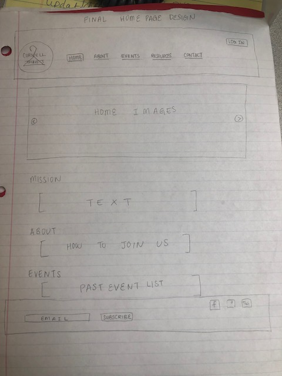
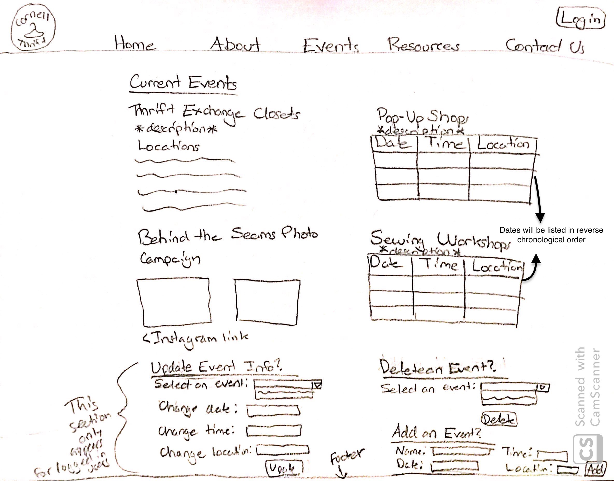

# Project 4: Design Journey

Your Team Name: Purple Tiger

**All images must be visible in Markdown Preview. No credit will be provided for images in your repository that are not properly linked in Markdown. Assume all file paths are case sensitive!**


## Client Description

[Tell us about your client. Who is your client? What kind of website do they want? What are their key goals?]

[NOTE: If you are redesigning an existing website, give us the current URL and some screenshots of the current site. Tell us how you plan to update the site in a significant way that meets the final project requirements.]

Our client is Cornell Thrift. They want a website for cornell students who are interested in the club activities: the events they are hosting and the organization mission. Their key goals are to have a new website that uses the content of their existing website with newly added features, such as forms for updating current event, forms for sign up
for mailing list, image gallery.


## Meeting Notes

[By this point, you have met once with your client to discuss all their requirements. Include your notes from the meeting, an email they sent you, or whatever you used to keep track of what was discussed at the meeting. Include these artifacts here.]

Meeting 1 Notes - Client Requirements:


## Purpose & Content

[Tell us the purpose of the website and what it is all about.]
The purpose of the website is to promote Cornell Thrift and have Cornell students know the upcoming events that Cornell Thrift is hosting.


## Target Audience(s)

[Tell us about the potential audience for this website. How, when, and where would they interact with the website? Get as much detail as possible from the client to help you find representative users.]

The potential audience for this website are members of the club and people at Cornell who are intersted in what Cornell Thrift do. The target audiences will be able to find mission of the club and more information (image and position) about eboard members. Also, they can look for the upcoming events/activities such as 'Thrift Exchange Closets' or 'Pop-up Shop'. For anyone who would like to be part of the club can subscribe for newsletter, they can fill out the form. Only Eboard members will be able to upload/delete events and gallery.

We decided that the client (i.e. E-Board members) should be considered a second target audience because there is a lot of funcionality that the client requested for its e-board members. There are a lot of aspects of the website that need to be regularly updated and E-board needs access to that. This aspect of the website is significant enough that we believed that it warranted making the client a second target audience.


## Client Requirements & Target Audiences' Needs

[Collect your client's needs and wants for the website. Come up with several appropriate design ideas on how those needs may be met. In the **Rationale** field, justify your ideas and add any additional comments you have. There is no specific number of needs required for this, but you need enough to do the job.]

- Client Requirement #1
  - **Requirement or Need** [What does your client and audience need or want?]
    - The client wants to retain site visitors and keep them informed via newslettlers
  - **Design Ideas and Choices** [How will you meet those needs or wants?]
    - Include a mailing list form in the footer to encourage users to sign up for the newsletter listserv
    - Show confirmation message once signed up
  - **Rationale** [Justify your decisions; additional notes.]
    - Having the mailing list form on every page would remind the visitor of the listserv opportunity.

- Client Requirement #2
  - **Requirement or Need** [What does your client and audience need or want?]
    - The thrift club wants people to be able to reach out to them for more information.
  - **Design Ideas and Choices** [How will you meet those needs or wants?]
    - Include a contact form on a contact page.
  - **Rationale** [Justify your decisions; additional notes.]
    - The contact form would allow users to send messages to the client and provide an email and name for correspondence.

- Target Audience Needs #1
  - **Requirement or Need** [What does your client and audience need or want?]
    - The Cornell students interested in thrift need to be aware of the upcoming events hosted by the client.
  - **Design Ideas and Choices** [How will you meet those needs or wants?]
    - Include the upcoming events near the top of the events page
  - **Rationale** [Justify your decisions; additional notes.]
    - This makes it easy for the visitors to find what events they should be looking out for.

- Target Audience Needs #2
  - **Requirement or Need** [What does your client and audience need or want?]
    - The E-Board members of the club need to be able to login and update site content.
    - Give logged in members access to forms that update the site.
  - **Design Ideas and Choices** [How will you meet those needs or wants?]
    - Include a login button in the header of the site so that members are able login appropriately.
    - Show a logout button when the members are logged in.
  - **Rationale** [Justify your decisions; additional notes.]
    - This creates intuitive user access control.


## Initial Design

[Include exploratory idea sketches of your website.]

### **Home Page**


### **About Page**


### **Events Page**


### **Resources Page**


### **Login Page**


### **Contact Page**


## Information Architecture, Content, and Navigation

[Lay out the plan for how you'll organize the site and which content will go where. Note any content (e.g., text, image) that you need to make/get from the client.]

[Document your process, we want to see how you came up with your content organization and website navigation.]

[Note: There is no specific amount to write here. You simply need enough content to do the job.]

Example:
- **Navigation**
  - Home
  - Portfolio
    - Websites
    - Mobile Apps
    - Tablets
  - About Me


Our:
  - Home
  - Members(Add Members & Modify Members)
  - Our Events
  - Thrifting Resources
  - Contact Us


- **Content** (List all the content corresponding to main navigation and sub-categories.)
  - *Portfolio*: list all the projects (as images) this client has worked on. When the image is hovered over, display a description of the project; add a search function to enable users search for specific projects;
  - *Websites*: showcase all the websites designed by the client, with thumbnail images and a brief description for each design;
  - *Mobile Apps*: showcase all the mobile apps designed by the client, with thumbnail images and a brief description for each design;
  - *Tablets*: showcase all the tablet applications designed by the client, with thumbnail images and a brief description for each design;

  *Our*:
    - *Home* : mission statement, slideshow about pictures about cornell thrift
    - *about* : committess that includes the team members and description of the committees
    - *our events* : include the Thrift exchange closets and locations
                    the behind the seams photo campaign and embedded link to instagram
                    pop up shops
                    sewing workshops
    - *thrifting resources* : resources hosted on old websited
    - *contact us* : form to contact Cornell Thrift with any questions and concerns
    - *login* : login/logout

- **Process**
  - [photo of card sort]
  - [explanation of how your come up with your content organization and navigation.]

 Explanation of content organization and navigation :
  - Client's target audience is Cornell Students who want to know about the club
  and know about the upcoming events.
  - Also, part of the client's needs on google doc they shared with us.

Most of the sorting of content came from how our client asked us to sort content and certain pages that they wanted on their website. However, we had a lot more leeway in terms of deciding how to implement a login form and various ways to contact the club. We started by putting the mailing list subscription and the get in touch with us form on the contact page, with the login form implemented in the nav bar.


Then we decided to move the mailing list subscription into the footer so that users could access the form no matter what page their on, thus fulfilling the client's goal of reaching as many students as possible through both their website and mailing list.


Finally, we decided to create a separate page for the login form in order to make the nav bar simpler for users.


## Interactivity

[What interactive features will your site have? What PHP elements will you include?]
* We have a login/logout page for the E-board members of Cornell Thrift. The login/logout link will appear on the top right of each page.
* If a E-board member of Cornell Thrift is logged in, then he or she can upload new pictures and update events(make changes to the website)
* We have a contact form where people can put in their name and email address and write a message to the Cornell Thrift club.
* Under each page, we will have a form that says "Sign up for the mailling list" and takes in people's email

[Also, describe how the interactivity connects with the needs of the clients/target audience.]
* The login and logout functionality will make sure that Cornell Thrift's E-board members can edit their website and upload new contents which is what our client wants.
* The contact form allows people who are interested in Cornell Thrift to interact with the Eboard members which is what our client wants.
* The mailling list sign up would allow people who are interest in Cornell Thrift to get more information about this club which is what our client wants to happen.

## Work Distribution

[Describe how each of your responsibilities will be distributed among your group members.]

[Set internal deadlines. Determine your internal dependencies. Whose task needs to be completed first in order for another person's task to be relevant? Be specific in your task descriptions so that everyone knows what needs to be done and can track the progress effectively. Consider how much time will be needed to review and integrate each other's work. Most of all, make sure that tasks are balanced across the team.]

Milestone 1

Initial Sketches
- Home - Susan
- Memebers - Yuyi
- Our Events - Samantha
- Thrifting Resources - Ha Yeon
- Contact Us, Header/Footer, Login - Clive

Clive has to sketch up the header and footer before the rest of the team and start their designs.

Milestone 2

- Samantha - Organize a team meeting in advance of the Milestone 2 deadline and the next client meeting

- Clive - Organize a second client meeting in advance of the Milestone 2 deadline

- Everyone is responsible for updating their own pseudocode, structure, and initial coding for each page/template as assigned above.

- The whole team will work together at the two team meetings to plan the database, update the design, and finish any other elements of the milestone not specified above.

Milestone 3

- Samantha - Organize a team meeting to work on the init.sql file to implement the database

- Everyone is responsible for implementing PHP elements and database interactivity for their individual page/templates as assigned above.

- Ha Yeon - Do final check of design to make sure there are no conflicts across pages.

Final Submission

- Everyone makes changes to their page as needed.

At Every Submissions

- Susan - Ensure we are on track to meet project guidelines and client expectations the night before the deadline

- Yuyi - Ensure that we are meeting each milestone requirement the night before the deadline


## Additional Comments

[If you feel like you haven't fully explained your design choices, or if you want to explain some other functions in your site (such as special design decisions that might not meet the final project requirements), you can use this space to justify your design choices or ask other questions about the project and process.]


--- <!-- ^^^ Milestone 1; vvv Milestone 2 -->

## Client Feedback

[Share the feedback notes you received from your client about your initial design.]

The client said that they liked our initial design and had no major changes to add except to make sure that we use their new logo design that they shared with us in our header.

## Iterated Design

[Improve your design based on the feedback you received from your client.]

Here is the updated logo the client requested that we use. We will alter the header design to reflect that.


## Evaluate your Design

[Use the GenderMag method to evaluate your wireframes.]

[Pick a persona that you believe will help you address the gender bias within your design.]

I've selected **[Abby/Patricia/Patrick/Tim]** as my persona.
Our group selected **[Abby]** as our persona.

I've selected my persona because... [Tell us why you picked your persona in 1-3 sentences. Your explanation should include why your persona will help you address gender-inclusiveness bugs in your design.]

We selected Abby because we feel like Abby isn't comfortable with technology and
we want to include all users - those who are comfortable and those who are not.
We want the website to be as user-friendly as possible, so even non-technical people
like Abby can navigate the site and accomplish their tasks.

### Tasks

[You will need to evaluate at least 2 tasks (known as scenarios in the GenderMag literature). List your tasks here. These tasks are the same as the task you learned in INFO/CS 1300.]

[For each task, list the ideal set of actions that you would like your users to take when working towards the task.]

__Scenario 1:__

Abby is a freshman at Cornell who is passionate about sustainability. A friend tells her she should check out Cornell Thrift and she decides to go on the club's website. She learns about the Thrift Exchange Closets that the club runs, but is disappointed to see that there are no closets on North Campus, where Abby lives. Abby wants to ask the club if they have any plans to put a closet somewhere on North Campus.

__Task 1:__ Abby wants to ask the club if they plan to add a Thrift Exchange Closet on North Campus.

  1. Go to Contact page   -Susan
    * a) Click on Contact in navigation bar
  2. Fill out information under "Get in Touch"  -Clive
    * a) Select the input field labelled "Name"
    * b) Type her name
    * c) Repeat Action #1 and #2 for input fields "Email" and "Message"
  3. Submit response  -Sam
    * a) Click send button

__Scenario 2:__

Abby is the treasurer of Cornell Thrift. Her photo on the webiste was taken when she was a freshman and had dyed her hair blue. Abby is now a junior and is trying to get an internship in finance for the summer. She includes her work as treasurer on her resume and wants to make sure her photo on the website is professional in case any firms decide to look her up online. She just took a professional headshot a week ago and would like to make that her picture on the website.

__Task 2:__ Abby wants to change her photo on the website to her new headshot.

  1. Log in - Grace
    * a) Select the input field labelled "Username"
    * b) Type her "Username"
    * c) Repeat Action #1 and #2 for the input field labelled "Password"
    * d) Click log-in button
  2. Go to Members page  -Susan
    * a) Click on Members page in navigation bar
  3. Navigate to the link to modify her profile -Yuyi
    * a) Find her profile on the members page
    * b) Click the "Modify Member's Information" link
  4. Upload her new profile picture -Sam
    * a) Click the browse button
    * b) Select the picture file she wants to upload
    * c) Click the "Modify" button

### Cognitive Walkthrough

[Perform a cognitive walkthrough using the GenderMag method for all of your Tasks. Use the GenderMag template in the <documents/gendermag-template.md> file.]

#### Task 1 - Cognitive Walkthrough

[copy the GenderMag template here and conduct a cognitive walkthrough to evaluate your design (wireframes).]

[You may need to add additional subgoals and/or actions for each task.]

**Task 1: Users wants to contact the club to ask a question.**

[Add as many subgoals as you needs]
**Subgoal # 1 : Go to Contact page**
	(e.g., "# 1 : Select the section of the document you want to print")

  - Will [Abby] have formed this sub-goal as a step to their overall goal?
    - Yes, maybe or no: [yes]
    - Why? (Especially consider [Abby]'s Motivations/Strategies.)

        Abby will be able to go to the Contact page because Abby has used
        technologies before and this task is not new. "Contact" is also
        a clear heading for the page.

[Add as many actions as you need...]
**Action # 1 : Click on Contact in navigation bar**
	(e.g., "# 1 : Put the mouse at the beginning of the section you want to print")

  - Will [persona name] know what to do at this step?
    - Yes, maybe or no: [yes]
    - Why? (Especially consider [Abby]'s Knowledge/Skills, Motivations/Strategies, Self-Efficacy and Tinkering.)

        Abby is not comfortable with new technology but clicking on
        a page in the navigation bar is not new.

  - If [Abby] does the right thing, will she know that she did the right thing, and is making progress towards her goal?
    - Yes, maybe or no: [yes]
    - Why? (Especially consider [Abby]'s Self-Efficacy and Attitude toward Risk.)

        Abby will be able to use a contact form and there should be a textbox
        to submit a question. So, she'll know she is in the right page.

**Subgoal # 2 : Fill out information under "Get in Touch"**

  - Will Abby have formed this sub-goal as a step to their overall goal?
    - Yes, maybe or no: Yes
    - Why? (Especially consider Abby's Motivations/Strategies.)

        * Each input field (Name, Email, and Message) on the contact page is labelled. Given that Abby has general exposure to technology this form would likely be familiar to her. Since Abby prefers to use familiar technology, she would comfortably form this sub-goal.

  **Action # 1 : Select the input field labelled "Name"**

    - Will Abby know what to do at this step?
      - Yes, maybe or no: Yes
      - Why? (Especially consider [persona name]'s Knowledge/Skills, Motivations/Strategies, Self-Efficacy and Tinkering.)

          Abby is an accountant, and since her job deals with keeping track of information she is probably familiar with input fields. This feature fits with Abby's low computer self-efficacy style since she does not have to go through unfamiliar processes.

    - If Abby does the right thing, will she know that she did the right thing, and is making progress towards her goal?
      - Yes, maybe or no: yes
      - Why? (Especially consider [persona name]'s Self-Efficacy and Attitude toward Risk.)

          The cursor would show up inside the input field. Given her comprehensive information processing style, she will easily access what happened.

  **Action # 2 : Type persona's "Name"**

  - Will Abby know what to do at this step?
    - Yes, maybe or no: Yes
    - Why? (Especially consider [persona name]'s Knowledge/Skills, Motivations/Strategies, Self-Efficacy and Tinkering.)

        The input field is labelled name. Abby gathers information comprehensively and she would realize that the name field is asking for her name for correspondence.

  - If Abby does the right thing, will she know that she did the right thing, and is making progress towards her goal?
    - Yes, maybe or no: Yes
    - Why? (Especially consider [persona name]'s Self-Efficacy and Attitude toward Risk.)

        The name will show up in the field as she types. Given her comprehensive information processing style, she will easily access what happened.

  **Action #3 : Repeat Action #1 and #2 for input fields "Email" and "Message"**

**Subgoal # 3 : Submit response**
	(e.g., "# 1 : Select the section of the document you want to print")

  - Will Abby have formed this sub-goal as a step to their overall goal?
    - Yes, maybe or no: [Yes]
    - Why? (Especially consider [persona name]'s Motivations/Strategies.)
        [Tell us why..]
      Abby will understand that once she has filled out the form she has to submit it. Although Abby does not like experimenting with new technology unnecessarily, submitting a form is a common feature across many websites that she will likely be familiar with.

[Add as many actions as you need...]
**Action # 1 : Click send button**
	(e.g., "# 1 : Put the mouse at the beginning of the section you want to print")

  - Will Abby know what to do at this step?
    - Yes, maybe or no: [Yes]
    - Why? (Especially consider [persona name]'s Knowledge/Skills, Motivations/Strategies, Self-Efficacy and Tinkering.)

        [Tell us why...]
      Submit buttons are a really common feature across a lot of different platforms, so despite Abby's limited comfort with computers, she will likely understand that she needs to click the button to submit her responses.

  - If Abby does the right thing, will she know that she did the right thing, and is making progress towards her goal?
    - Yes, maybe or no: [maybe]
    - Why? (Especially consider [persona name]'s Self-Efficacy and Attitude toward Risk.)

        [Tell us why...]
      Right now, the website design doesn't indicate any kind of confirmation page after the form is successfully submitted. If no confirmation page pops up after she clicks submit, since Abby has low self-efficacy she will likely believe she did something wrong. However, if a confirmation page is included, Abby would likely understand that she did the right thing because the page would say she successfully submitted her response.

#### Task 2 - Cognitive Walkthrough

**Task 2: Client can modify members' information on Members page.**

[Add as many subgoals as you needs]

**Subgoal # 1 : Log in**

  - Will Abby have formed this sub-goal as a step to their overall goal?
    - Yes, maybe or no: [yes]
    - Why? Abby is aware that in order to upload an image, she has to log in. Since logging in is a familiar task for Abby who uses technologies to accomplish her tasks, she will have formed this sub-goal as a step to their overall goal.

**Action # 1 : Select the input field labelled "Username"**

  - Will Abby know what to do at this step?
    - Yes, maybe or no: [yes]
    - Why? Abby will know that she has to select the input field labelled "username". She feels comfortable using technologies that she uses on regular basis. It is clear that she needs to select the input field before typign down her username.

  - If Abby does the right thing, will she know that she did the right thing, and is making progress towards her goal?
    - Yes, maybe or no: [yes]
    - Why? Abby will know that she did the right thing because by selecting the input field she will be able to type down her username and eventually sign in. There is nothing unfamiliar about this action for Abby.


**Action # 2 : Type her "Username"**

  - Will Abby know what to do at this step?
    - Yes, maybe or no: [yes]
    - Why? Abby will know that she has to type her username into the input field. She feels confident in using technologies that she feels comfortable with.

  - If Abby does the right thing, will she know that she did the right thing, and is making progress towards her goal?
    - Yes, maybe or no: [yes]
    - Why? If Abby does the right thing, she will know that she is making progress towards her goal because username would be filled in the input field. There is nothing unfamiliar about this action, and she does not need to spend extra time using unfamilar techonologies.


**Action # 3 : Repeat Action #1 and #2 for the input field labelled "Password"**

  - Will Abby know what to do at this step?
    - Yes, maybe or no: [yes]
    - Why? Same as above

**Action # 4 : Click log-in button**

  - Will Abby know what to do at this step?
    - Yes, maybe or no: [yes]
    - Why? Abby will know what to do after she fills in username and password in each input field. Loggin in is a familiar job for Abby who works as an accountant. She does not need to tinker with software systems that are new to her.

  - If Abby does the right thing, will she know that she did the right thing, and is making progress towards her goal?
    - Yes, maybe or no: [yes]
    - Why? Abby will know that she made a progress towards her goal, because when she clicks the log-in button, she will be logged in and eventually be able to fill out form to upload an image. Although she feels not confident when using technologies that are not used to her, logging in is not a high-level skill. It won't take much time for her.

**Subgoal # 2 : Go to Members page**
	(e.g., "# 1 : Select the section of the document you want to print")

  - Will [Abby] have formed this sub-goal as a step to their overall goal?
    - Yes, maybe or no: [maybe]
    - Why? (Especially consider [persona name]'s Motivations/Strategies.)

      Abby may not know that to upload an eboard image that she should
      go to the Members page, but using the navigation bar is not a new task.

[Add as many actions as you need...]
**Action # 1 : Click on Members page in navigation bar**
	(e.g., "# 1 : Put the mouse at the beginning of the section you want to print")

  - Will [Abby] know what to do at this step?
    - Yes, maybe or no: [maybe]
    - Why? (Especially consider [Abby]'s Knowledge/Skills, Motivations/Strategies, Self-Efficacy and Tinkering.)

        Abby does not like to tinker but clicking on different pages in the
        navigation bar does not produce any risk.

  - If [persona name] does the right thing, will she know that she did the right thing, and is making progress towards her goal?
    - Yes, maybe or no: [yes]
    - Why? (Especially consider [persona name]'s Self-Efficacy and Attitude toward Risk.)

        Once Abby arrives in Members page, she will know that this is the page to
        upload an eboard image since she will see a gallery with eboard members.

**Subgoal # 3 : Navigate to the link to modify her profile**
	(e.g., "# 1 : Select the section of the document you want to print")

  - Will [persona name] have formed this sub-goal as a step to their overall goal?
    - Yes, maybe or no: [yes]
    - Why? (Especially consider [persona name]'s Motivations/Strategies.)

        [Tell us why..]

[Add as many actions as you need...]
**Action # 1 : Find her profile on the members page**
	(e.g., "# 1 : Put the mouse at the beginning of the section you want to print")

  - Will [persona name] know what to do at this step?
    - Yes, maybe or no: [yes]
    - Why? (Especially consider [persona name]'s Knowledge/Skills, Motivations/Strategies, Self-Efficacy and Tinkering.)

    Abby doesn't like tinkering, but there's no tinkering needed on this page. On the top of the Members page it clearly says "Meet Our E-Board Members" so Abby knows that all she needs to do to find her profile is to scroll down. Since there aren't that many E-board members, it wouldn't take Abby much time to find her own.

  - If [persona name] does the right thing, will she know that she did the right thing, and is making progress towards her goal?
    - Yes, maybe or no: [yes]
    - Why? (Especially consider [persona name]'s Self-Efficacy and Attitude toward Risk.)

      She will recognize her own profile.

**Action # 2 : Click the "Modify Member's Information" link**
	(e.g., "# 1 : Put the mouse at the beginning of the section you want to print")

  - Will [persona name] know what to do at this step?
    - Yes, maybe or no: [yes]
    - Why? (Especially consider [persona name]'s Knowledge/Skills, Motivations/Strategies, Self-Efficacy and Tinkering.)

    Abby has low self-efficacy and doesn't like tinkering, but since there's a link that says "Modify Member's Information" directly below her profile, she will know that that's the link she needs to click to modify her profile without any tinkering.

  - If [persona name] does the right thing, will she know that she did the right thing, and is making progress towards her goal?
    - Yes, maybe or no: [yes]
    - Why? (Especially consider [persona name]'s Self-Efficacy and Attitude toward Risk.)

     After clicking on the "Modify Member's Information" link, Abby will be brought to a seperate page that says "Modify Abby's Information" with her existing profile and information there. Although Abby tends to have low self-efficacy, with the clear title and her existing profile, Abby will know that she did the right thing and has been brought to the right place.

**Subgoal # 4 : Upload her new profile picture**
	(e.g., "# 1 : Select the section of the document you want to print")

  - Will Abby have formed this sub-goal as a step to their overall goal?
    - Yes, maybe or no: [Yes]
    - Why? (Especially consider [Abby's]'s Motivations/Strategies.)

        [Tell us why..]
     In order for her profile picture to be changed, Abby will have to upload it to the site. The most essential step to altering a picture on a website is uploading a new one. This is a feature that is common across many popular social networking sites that include profile pictures, like Facebook, Instagram, and LinkedIn. It is likely that Abby would be familiar with these sites and thus recognize that she has to upload a photo in order for it to change on the website, so this would be in line with her strategy to use familiar technological methods to accomplish her tasks.

[Add as many actions as you need...]
**Action # 1 : Click the browse button**
	(e.g., "# 1 : Put the mouse at the beginning of the section you want to print")

  - Will Abby know what to do at this step?
    - Yes, maybe or no: [maybe]
    - Why? (Especially consider [persona name]'s Knowledge/Skills, Motivations/Strategies, Self-Efficacy and Tinkering.)

        [Tell us why...]
      Abby is not very comfortable with computers, so since the button does not explicitly say the word "upload" and the label only says "Profile" and not "Profile Picture" or "Upload profile picture," she may be unsure if that is the correct button to click. However, the text next to it saying "no file selected" may hint that she needs to click the button to upload a file from her computer. She also may assume that the profile label refers to the photo and understand she needs to click the browse button to upload a new photo from her computer. However, since the labels don't explicitly identify the task, it is hard to say whether Abby will know what to do.


  - If Abby does the right thing, will she know that she did the right thing, and is making progress towards her goal?
    - Yes, maybe or no: [Maybe]
    - Why? (Especially consider [persona name]'s Self-Efficacy and Attitude toward Risk.)

        [Tell us why...]
    Once she clicks the browse button, she will see her Finder or My Computer page appear giving her the option to select a file, so she will understand that she is supposed to upload a file, and may then conclude that she has done the right thing. However, because she is so risk averse and uncomfortable with technology, she may doubt herself and believe that this file upload button is for a different file and not for the profile picture due to a lack of clear labeling on the form.

**Action # 2 : Select the picture file she wants to upload and click the open/upload button**
	(e.g., "# 1 : Put the mouse at the beginning of the section you want to print")

  - Will Abby know what to do at this step?
    - Yes, maybe or no: [yes]
    - Why? (Especially consider [persona name]'s Knowledge/Skills, Motivations/Strategies, Self-Efficacy and Tinkering.)

        [Tell us why...]
      While Abby is not very comfortable with computers, she will likely understand that she needs to select the appropriate image file and click the open/upload button in order to upload it.


  - If Abby does the right thing, will she know that she did the right thing, and is making progress towards her goal?
    - Yes, maybe or no: [Yes]
    - Why? (Especially consider [persona name]'s Self-Efficacy and Attitude toward Risk.)

        [Tell us why...]
    Abby will know that she did the right thing because she will see the file name that she selected appear on the screen, so despite her lack of confidence in her computer skills, she will know that she selected and uploaded the picture that she wanted to upload.

**Action # 3 : Click the "Modify" button**
	(e.g., "# 1 : Put the mouse at the beginning of the section you want to print")

  - Will Abby know what to do at this step?
    - Yes, maybe or no: [no]
    - Why? (Especially consider [persona name]'s Knowledge/Skills, Motivations/Strategies, Self-Efficacy and Tinkering.)

        [Tell us why...]
      Abby may thing she has done all she needed to do by hitting the upload button. Since she is not particularly knowledgeable about technology and not interested in tinkering around with it, she may not understand that she needs to click the modify button in order to actually change the photo. She may think she has done everything she needed to do and click the link to return to the members page instead. Only then would she realize she had not done the right thing and potentially figure out she needed to click the modify button to solidify the changes.

  - If Abby does the right thing, will she know that she did the right thing, and is making progress towards her goal?
    - Yes, maybe or no: [Maybe]
    - Why? (Especially consider [persona name]'s Self-Efficacy and Attitude toward Risk.)

        [Tell us why...]
    If she returns to the members page, she will immediately see the change in the image and know she did the right thing. If she does not return to the members page immediately, she may not know whether she successfully changed the image and because of her low self-efficacy, she may not believe she completed her goal.

### Cognitive Walk-though Results

[Did you discover any issues with your design? What were they? How will you change your design to address the gender-inclusiveness bugs you discovered?]

[Your responses here should be **very** thorough and thoughtful.]

Our current design does not make clear whether there will be a confirmation once the form is sucessfully submitted, or any corrective feedback should the user not fill in aspects of a form correctly. It is important that corrective feedback and a confirmation message are factored into the design as users with low self-efficacy may struggle with both understanding their mistakes and knowing if they submitted forms correctly because of a lack of feedback. Our final design should include a confirmation message for every form and corrective feedback when users submit invalid responses.

We also do not always label our forms appropriately so that it is super clear what a user has to do, particularly when it comes to uploading a profile picture to the members page. Users who are less comfortable with technology or who don't like tinkering may be left unsure of what to do when attempting to do things like upload a new profile picture.

## Final Design

[Include sketches of your finalized design.]

[What changes did you make to your final design based on the results on your cognitive walkthrough?]


 Based on Cognitive Walkthrough, I added links to each page and description in home.
Members

We made sure that we have clear instructions throughout the webpage so people who don't like tinkering can complete their tasks without getting confused.

This is what unlogged in users will see:


This is what logged in users will see:

If the user clicks the "Modify" buttom, php will automatically fill out the "Add/Modify" form with the original information. The user just need to edit the category that he or she wants to modify, and click the "Add/Modify" buttom to update the information

Events

We made sure to clearly add a confirmation page so that  users who are less comfortable with computers understand that they have successfully submitted the form.




Resources page was pretty straightforward, so I just changed the logo.


## Database Schema

[Describe the structure of your database. You may use words or a picture. A bulleted list is probably the simplest way to do this.]

Table: users
* id: INTEGER {PK, U, Not, AI} -- surrogate primary key
* username: TEXT {U}
* password: TEXT {}
* eboard: TEXT {Not}

Table: sessions
* id: INTEGER {PK, U, Not, AI} -- surrogate primary key
* user_id: INTEGER {Not}
* session TEXT {Not, U}

Table: home_images
* id: INTEGER {PK, U, Not, AI} -- surrogate primary key
* filename: TEXT {Not}
* file_extension: TEXT {Not}

Table: about_images
* id: INTEGER {PK, U, Not, AI} -- surrogate primary key
* name: TEXT {Not}
* ext: TEXT {Not}
* job: TEXT {Not}

Table: resources_stores
* id: INTEGER {PK, U, Not, AI} -- surrogate primary key
* store_name: TEXT {Not}
* store_address: TEXT {Not}
* store_description: TEXT {Not}
* store_hours: TEXT {Not}
* store_price: TEXT {Not}

Table: events
* id: INTEGER {PK, U, Not, AI} -- surrogate primary key
* type: INTEGER {Not}
* name: TEXT {Not}
* date: TEXT {}
* location: TEXT {}
* time: TEXT {}

Table: messages
* id: INTEGER {PK, U, Not, AI} -- surrogate primary key
* name: TEXT {Not}
* email: TEXT {Not}
* message: TEXT {Not}

Table: mail_list
* id: INTEGER {PK, U, Not, AI} -- surrogate primary key
* email: TEXT {Not, U}

## Database Queries

[Plan your database queries. You may use natural language, pseudocode, or SQL.]

```php
  $home_records = exec_sql_query(
    $db,
    "SELECT * FROM home_images"
  )->fetchAll();

    $sql = "INSERT INTO images (user_id, filename, file_extention, description)
      VALUES (:user_id, :filename, :upload_ext, :description);";
    $params = array(
      ':user_id' => $current_user['id'],
      ':filename' => $filename,
      ':upload_ext' => $upload_ext,
      ':description' => $description
    );
    $new_record = exec_sql_query($db, $sql, $params);
```

```php
//add new event
$sql = "INSERT INTO events (event_name, event_date, event_location, event_time) VALUES (:event_name, :event_date, :event_location, :event_time):";
$params = array (
  ':event_name' => $event_name,
  ':event_date' => $event_date,
  ':event_location' => $event_location,
  ':event_time' => $event_time
);
$new_event = exec_sql_query($db, $sql, $params);

//delete an event
$sql = "DELETE FROM events WHERE event_name = :event_name;";
$params = array (
  ':event_name' => $event_name
);
$delete_event = exec_sql_query($db, $sql, $params);

//update an event (could be done this way with date, location or time)
$sql = "UPDATE events SET event_date = :event_date WHERE event_name = :event_name;";
$params = array (
  ':event_name' => $event_name
  ':event_date' => $event_date
);
$update_event = exec_sql_query($db, $sql, $params);
```

### Adding Contact Form Message to `messages`

```sql
  INSERT INTO messages (name, email, message) VALUES (:name, :email, :message);
```

### Adding Emails to `mail_list`

```sql
  INSERT INTO messages (email) VALUES (:email);
```

### Delete a member

```sql
  DELETE FROM about_images WHERE id = $img_id;
```

### Add a member

```sql
  INSERT INTO about_images (name, ext, description) VALUES ($name, $ext, $description);
```

### Select a member

```sql
  SELECT name, ext, description FROM about_images WHERE id = $img_id;
```

## PHP File Structure

[List the PHP files you will have. You will probably want to do this with a bulleted list.]

* index.php - home page.
* includes/init.php - stuff that useful for every web page.
* includes/header.php - the header for every page
* includes/footer.php - the footer for every page
* about.php - members and committees
* add_member.php - add member form
* modify_member.php - modify member form
* events.php - events page
* resources_tips.php - Cornell Thrift resources: thrift tips
* resources_stores.php - Cornell Thrift resources: near by thrift stores
* contact.php - the user submit a question page
* login.php - log in page


## Pseudocode

[For each PHP file, plan out your pseudocode. You probably want a subheading for each file.]

### init.php

```
Pseudocode for index.php...

include init.php

TODO

// open connection to database
$db = open_or_init_sqlite_db('secure/gallery.sqlite', 'secure/init.sql');

// length of login is 1 hour = 60s * 60min * 1hr
define('SESSION_COOKIE_DURATION', 60 * 60 * 1);
// messages is an array
$session_messages = array();

function login($username, $password) {}
function finduser($user_id) {}
function findsession($session) {}
function session_login() {}
function is_user_login() {}
function logout() {}

```


### header.php

```
include init.php

  <nav id="nav">
    <?php
    $pages = [
      ["index.php", "HOME"], ["about.php", "ABOUT"], ["events.php", "EVENTS"],
      ["resources_tip.php", "RESOURCE TIP"], ["resources_stores.php", "RESOURCE STORES"],
      ["contact.php", "CONTACT"]
    ];
    $current_file = basename($_SERVER['PHP_SELF']);

    foreach ($pages as $p) { ?>
      <li><a href="<?php echo $p[0]; ?>" class="<?php if ($p[0] == $current_file) {
                                                  echo " format_page";
                                                } ?>">
          <?php echo $p[1]; ?></a></li>
    <?php

  } ?>
  </nav>

```

### footer.php

#### collecting emails for mailing list

```
 if isset($_POST['mailing_list_submit'])
    $email = sanitize($_POST['email'])
    $sql = 'INSERT INTO mail_list (email) VALUES (:email);'
    $params = array(:email => $email);
    execute_sql($db, $sql, $params);
```

### contact.php

#### storing user's messages

```
 if isset($_POST['contact_submit'])
    $name = sanitize($_POST['name'])
    $email = sanitize($_POST['email'])
    $message = sanitize($_POST['message'])
    $sql = 'INSERT INTO messages (name, email, message)
            VALUES (:name, :email, :message);'
    $params = array(:name => $name,
                    :email => $email,
                    :message => $message);
    execute_sql($db, $sql, $params);
```

### login.php

### check user login credentials

```
 if isset($_POST['login_submit']) and !user_logged_in
    $username = sanitize($_POST['user'])
    $password = sanitize($_POST['password'])
    login($username, $password)
```


### index.php

```
Pseudocode for index.php...

include init.php

TODO
// display images in the slideshow
   <div class="slideshow-box">
      <div class="slideshow">
        <?php
        foreach ($records as $record) { ?>
          " src="uploads/home/<?php echo ($record["id"] . "." . $record["file_ext"]); ?>">
          <div class="home_img_cap"><?php echo $record["desc"]; ?></div>
        <?php
      }
      ?>
      </div>
// need functions to make the slideshow
function moveSlides ($image_id) {}
function currentSlide ($image_id) {}
function showSlides () {}

```

### about.php

```
Members Page Pseudocode:

function delete_member($img_id) {
  Delete the image that has the id as $img_id
}

function insert_new_member($name, $branch, $description){
  Insert a new member using $name, $branch, $description
}

//add a new member
if the user is logged in and clicks on the "add button"{
  get the input name, position and profile

  if there's no upload error{
    fiter the input name, position and profile
    get the file extension
    check whether or not any of them is null
    if any of them is null{
      display an error message
      don't insert into the database
    }
    else{
      insert input name, extention and position into the database
      get the last inserted image id and create a path for the newly uploaded profile
      move the newly uploaded profile into the correct path for display
      show upload successful message
    }
  }
}

//modify a current member
get the current image id using http parameters
use this id to get the member's name, extention and position
make a sticky form using these values
success is TRUE

if the user is logged in and clicks on the "modify button"{
  get the input name, position and profile
  if name or position is NULL{
    success is FALSE
    display an error message
  }
  else{
    filter input and set the original name, position and profile equal to the new input
  }
  if no image is uploaded{
    do nothing
  }
  else if there's an error{
    display the error accordingly
  }
  else if there's no error{
    sanitize the file and update the image extension
    move the new file to the original file's path to replace it
  }

  if success is TRUE{
    display successful message
  }
}

//delete a member
if the user is logged in and clicked on the "delete" button{
  get the image id using http parameters
  call function delete_member and send over the image id
}

```

### events.php

```
include init.php

include header.php

for each element in events table {
  <table>
  <tr>
  select * from events where event_name = element
  </tr>
  </table>
}

update form
if update form is submitted
  if date is not null
    update date in table
  if location is not null
    update locaiton in table
  if time is not null
    update time in table

delete form
if delete form is submitted
  delete entry where event_name = user_input

add form
if add form is submitted
  insert entry to table

include footer.php
```


### resources_tips.php

```
Pseudocode for resources_tips.php...

include init.php
include header.php

just write down top 7 pro thrift tips.

include footer.php

```


### resources_stores.php

```
Pseudocode for resources_stores.php...

include init.php
include header.php

insert table for each categorized thrift stores.

include footer.php
```


## Additional Comments

[Add any additional comments you have here.]


--- <!-- ^^^ Milestone 2; vvv Milestone 3 -->

## Issues & Challenges

[Tell us about any issues or challenges you faced while trying to complete milestone 3. Bullet points preferred.]
  * Bringing the site together as a whole
  * CSS conflicts and overwritten code
  * queries sometimes not running

* Realized that the way the events table was set up was not going to be sufficient for the website so how to completely restructure it can create 3 tables (similar to the images, tags, and image_tags tables from Project 3). This created a lot of complications and required me to redo and rethink how to do the SQL queries for the events page.

* Still struggling with the CSS layout of events page. There are a lot of parts involved and it has been difficult to make it look the way I want it to.


--- <!-- ^^^ Milestone 3; vvv FINAL SUBMISSION-->

## Final Notes to the Clients

[Include any other information that your client needs to know about your final website design. For example, what client wants or needs were unable to be realized in your final product? Why were you unable to meet those wants/needs?]


## Final Notes to the Graders

[1. Give us three specific strengths of your site that sets it apart from the previous website of the client (if applicable) and/or from other websites. Think of this as your chance to argue for the things you did really well.]

[2. Tell us about things that don't work, what you wanted to implement, or what you would do if you keep working with the client in the future. Give justifications.]

[3. Tell us anything else you need us to know for when we're looking at the project.]
